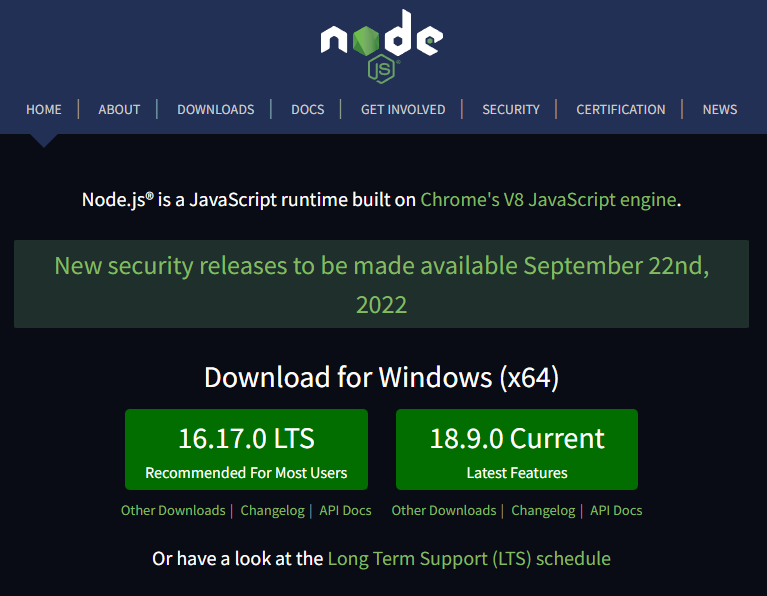
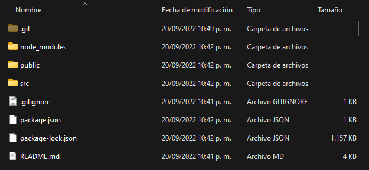
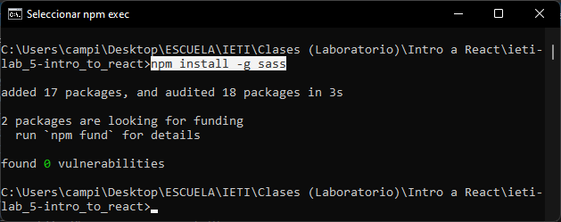
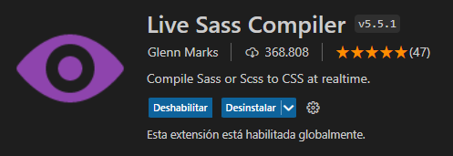
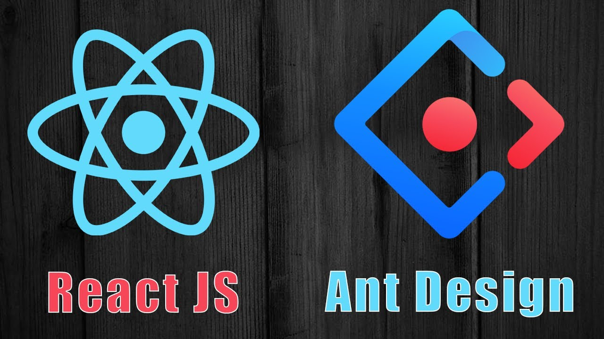
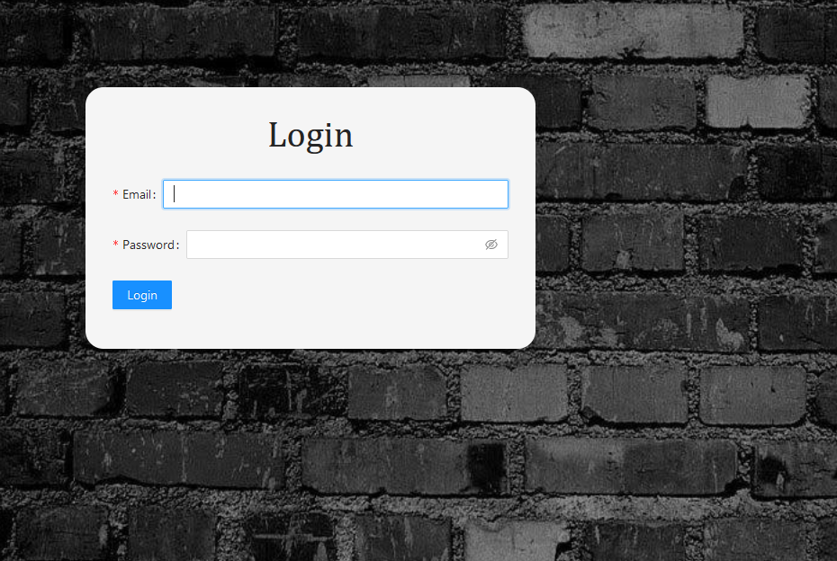

# Laboratorio 5: Intro to React JS

## Inovación y Emprendimiento con Tecnologías de Información

#### Camilo Andrés Pichimata Cárdenas

##### Septiembre del 2022

## Desarrollo

### Creación de la aplicación React

Para la creación de una **Aplicación React** se desargó e instaló `Node.js` con su sistema de gestión de paquetes `npm` desde su página web `https://nodejs.org/en/`



Seguido a esto, desde el directorio en el cuál se desea crear el proyecto se ejecuta el siguiente comando con el fin de crear el proyecto:

```
npx create-react-app ieti-lab_5-intro_to_react
```

Esto genera la estructura del proyecto e incluso genera el repositorio git (comando `git init`) con el primer commit listo para cargar los archivos al repositorio:




### Instalación de SASS

Con el fín de poder implementar los estilos de nuestra aplicación con **SASS** debemos instalar la dependencia, para esto ejecutamos el siguiente comando:

```
npm install -g sass
```



Seguido a esto, para facilitar la compilación de archivos de tipo `.scss` a archivos de tipo `.css` podemos descargar una extensión desde *Visual Studio Code* llamada Live Sass Compiler, esta genera automáticamente los archivos `.css` al guardar el archivo de tipo `.scss`:



Realizado esto ya podemos crear archivos de tipo `.scss` y utilizar la extensión para compilarlos y obtener nuestros archivos de tipo `.css`


### Instalación de Ant

Con el fín de mejorar el diseño de la página se hará uso de la librería UI `Ant`:



Para instalarla en nuestro proyecto ejecutamos el siguiente comando desde la consola:

```
npm install antd
```
 
E importamos en el archivo algunos componentes de la librería en el archivo `index.js` de la siguiente manera:

```
import {Form, Input, Button, Col, Row} from 'antd';
```

A partir de ahí se realizan las implementaciones necesarias y el resultado es el siguiente:



